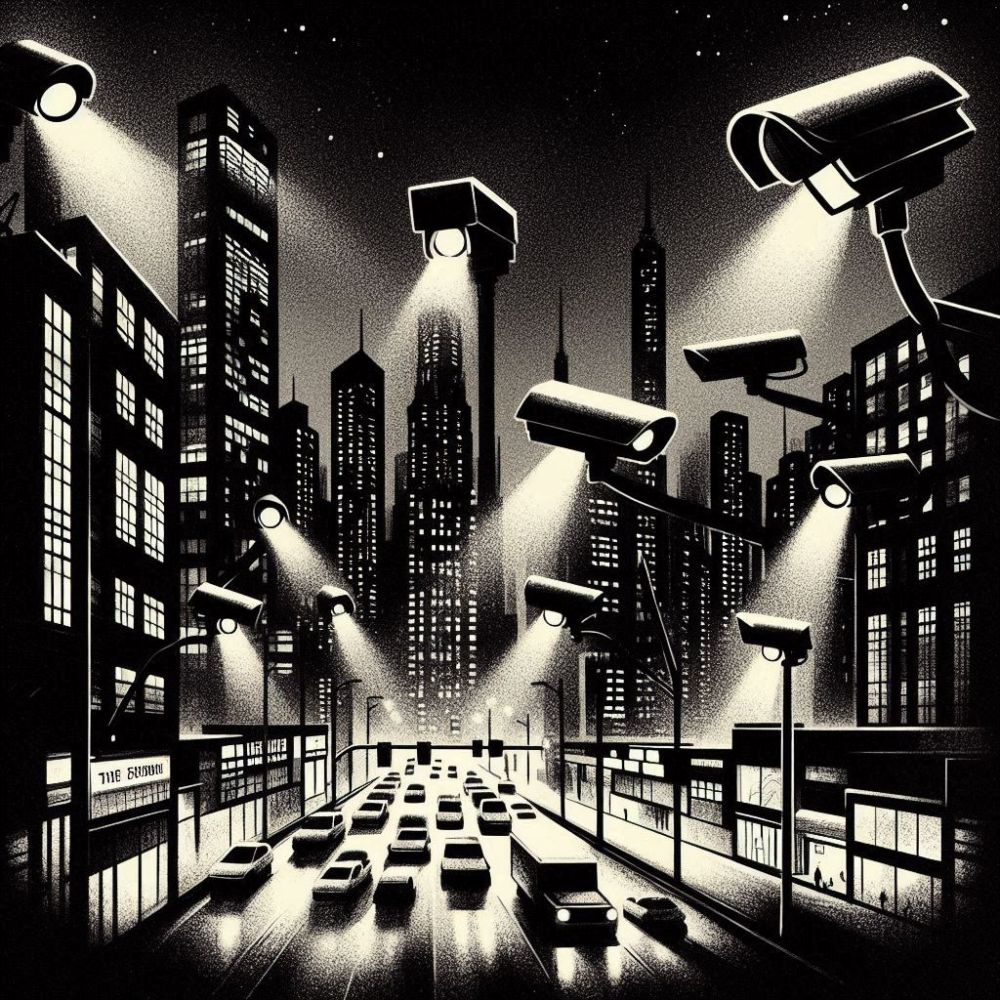
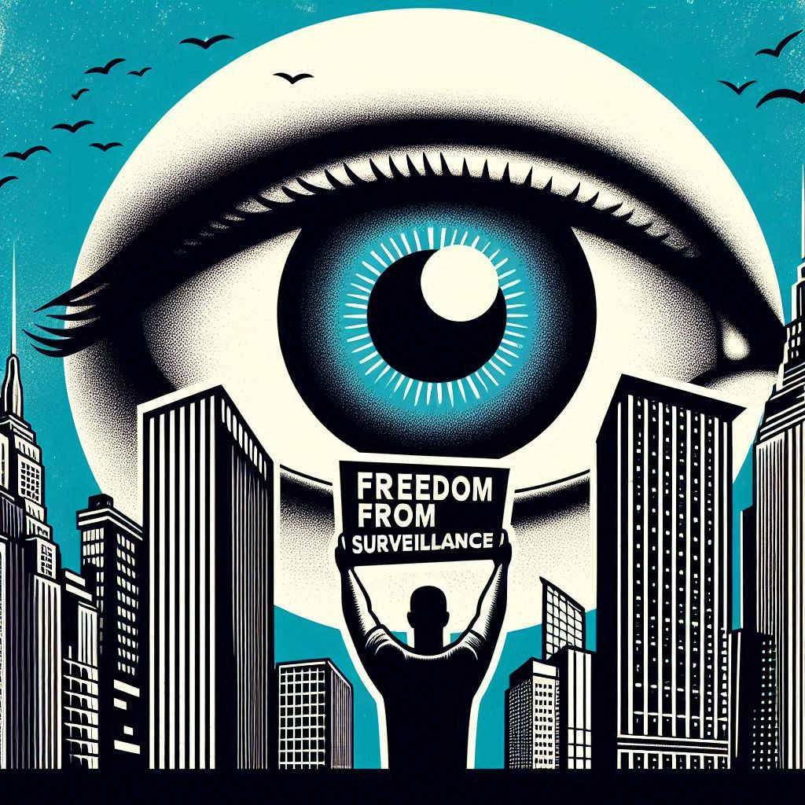

# George-Was-Right - README.md

---



---

[](https://opensource.org/licenses/MIT)
[](https://www.python.org/downloads/release/python-380/)
[](https://www.codefactor.io/repository/github/therealfredp3d/george-was-right)
[](https://sourcery.ai)

---

## Introduction

### The Making of George-Was-Right

This project began as a way for me to gain hands-on experience while learning Python. It's an evolving work-in-progress that grows as I improve my coding skills and explore new technologies. Starting from basic scripting, I've integrated multi-agent collaboration using CrewAI, explored natural language processing with LLMs, and ventured into creative visualizations with tools like DALL-E.

Creating George-Was-Right has been both a challenge and a deeply rewarding experience, showcasing how learning in public and building projects can transform abstract concepts into practical applications.

I'm excited to see where this journey takes me next and how it will continue to shape my understanding of AI and its potential to impact society.

---

## Overview

George-Was-Right is an AI-powered analysis system that explores the relevance of George Orwell's *1984* in the context of modern surveillance and privacy issues.  It utilizes a multi-agent framework powered by CrewAI, orchestrating the collaboration of three distinct AI agents:

* **Researcher Agent:** Scours the web for recent news and information related to surveillance technologies, data breaches, and social control mechanisms.
* **Writer Agent:**  Analyzes the research findings, drawing parallels between current events and the themes and predictions presented in *1984*.  This agent crafts a comprehensive report summarizing the analysis.
* **Illustrator Agent:** Generates creative prompts for illustrations that visually depict the connections between modern surveillance practices and Orwell's dystopian vision.

This project aims to provide a nuanced and insightful examination of how contemporary society reflects the concerns raised in *1984*, fostering discussion and awareness about digital privacy and freedom.

---


---

## Features

* **Automated Research and Analysis:** Streamlines the process of gathering information and connecting it to relevant themes from *1984*.
* **Multi-Agent Collaboration:** Leverages the power of specialized agents working together to achieve a complex analytical goal.
* **Visual Prompt Generation:**  Facilitates the creation of compelling visuals that enhance the analysis and engage a wider audience.
* **Customizable Search Parameters:** Allows users to specify the country and number of search results to tailor the research focus.
* (Work in Progress) **GUI Integration:** Offers a user-friendly graphical interface for controlling the analysis process, monitoring progress, and saving reports.
* (Work in Progress) **Clear and Structured Output:** Generates a well-organized markdown report that presents the research findings, analysis, and illustration prompts in a cohesive manner.

---


](images/freedom-from-surveillance3.jpg)

---

## Getting Started

### Prerequisites

* Python 3.8+
* Required libraries (install via `pip install -r requirements.txt`):

* `python-dotenv`
* `crewai`
* `crewai_tools`
* `rich`

* API Keys:
  * SerperDev API Key (for web searching): Obtain from [https://serper.dev/](https://serper.dev/) and store in a `.env` file as `SERPER_API_KEY=<your_key>`.
  
  > There are some LLM models and API providers listed in the llm_models folder.  

  I use this one for now: [https://glhf.chat/](https://glhf.chat/).  It's free and works well.  

  * GLHF API Key (for Qwen LLM): Obtain from [https://glhf.chat/](https://glhf.chat/) and store in your environment or `.env` file as   `GLHF_API_KEY=<your_key>`.  

---


### How to set the LLM provider and model

CrewAI use LiteLLM to manage API calls various providers. [https://docs.litellm.ai/docs/providers](https://docs.litellm.ai/docs/providers).

It's easy to change from one to the other. Simply modify this code:

`llm=LLM(model="github/gpt-4o")`

---

### Save the API Key

Store your API keys in:

1 - /.env File
`echo 'GROQ_API_KEY=<your_key>' >> .env`

           or 

2 - Environment Variable

`export GROQ_API_KEY=<your_key>)`

```python
# /src/config.py

# LLM Model Configuration
# Example

llm=LLM(model="github/gpt-4o")
llm=LLM(model="gemini/gemini-1.5-pro")
llm=LLM(model="ollama/llama3.2-70b-vision-instruct")

llm=LLM(model="hf:Qwen/QwQ-32B-Preview", api_key=os.getenv("GLHF_API_KEY"), base_url="https://glhf.chat/api/openai/v1")
```

You can  find more details in the documentation here:

[https://docs.litellm.ai/docs/providers](https://docs.litellm.ai/docs/providers)

---

### Running the Application

1. Clone the repository: `git clone https://github.com/therealfredp3d/george-was-right.git`
2. Navigate to the project directory: `cd george-was-right`
3. Install the requirements: `pip install -r requirements.txt`
4. Create a `.env` file in the project directory and add your SerperDev API key.
5. Run the application: `python -m src.main`

---


## Configuration

The project can be configured by modifying these variables in `/src/config.py`:

* `COUNTRY`: The two-letter country code to focus the news search on (default: "us").
* `SEARCH_RESULTS`: The number of search results to retrieve (default: 1).
* `LLM_MODEL`:  The LLM model to use.  
  (Currently configured for `hf:Qwen/QwQ-32B-Preview` via GLHF.  Ensure your API key is set correctly.)

---

## Future Development

* Enhanced error handling and logging.
* More flexible LLM model selection.
* Improved output formatting and visualization.
* Integration with illustration generation services (Dall-E, Midjourney, etc).

---

## Conclusion

The "George-Was-Right" project is a comprehensive exploration of the relevance of Orwell's 1984 in today's world, effectively utilizing AI agents to analyze and visualize the implications of modern surveillance practices. The integration of various tools and the focus on multi-agent collaboration make it a robust framework for understanding and discussing critical issues related to privacy and social control. Future developments could further enhance its usability and impact.

## Contributing

Contributions are welcome!  See `.github/CONTRIBUTING.md` for guidelines.

---

## License

MIT License  See `LICENSE` for details.

---

## Security

See `.github/SECURITY.md` for security information.

---

## Acknowledgments

* [SerperDev](https://serper.dev/) for the news search API.
* [GLHF](https://glhf.chat/) for their free LLM models.
* [CrewAI](https://www.crewai.com/) for their collaborative AI agent framework.

Having all these tools at your disposal for free 🤯 is truly amazing for a self-taught developer like me.  
I'm incredibly grateful for the open-source community and the learning opportunities it provides.
