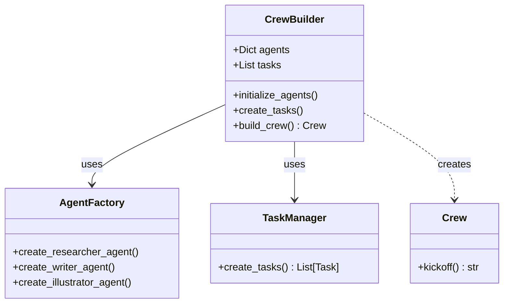

```mermaid
classDiagram
    class CrewBuilder {
        +Dict agents
        +List tasks
        +initialize_agents()
        +create_tasks()
        +build_crew() Crew
    }
    class AgentFactory {
        +create_researcher_agent()
        +create_writer_agent()
        +create_illustrator_agent()
    }
    class TaskManager {
        +create_tasks() List[Task]
    }
    class Crew {
        +kickoff() str
    }
    CrewBuilder --> AgentFactory: uses
    CrewBuilder --> TaskManager: uses
    CrewBuilder ..> Crew: creates
```
