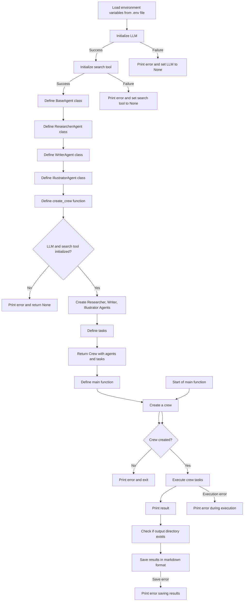

# George was Right - Flowchart

## Flowchart

## Overview

1. **Environment Initialization**: The program starts by loading environment variables from a `.env` file using `dotenv`. These variables include API keys needed for the Large Language Model (LLM) and search tools.

2. **LLM Initialization**: The program attempts to initialize the Large Language Model using a predefined model (`LLM_MODEL`). If successful, it proceeds to initialize the search tool; if not, it prints an error and sets the LLM to `None`.

3. **Search Tool Initialization**: Similarly, the program attempts to set up the `SerperDevTool` for internet searching. On failure, an error is logged, and the search tool is set to `None`.

4. **Agent Class Definitions**:
   - **BaseAgent**: A general class for creating agents with shared parameters such as role, goal, and other attributes.
   - **ResearcherAgent, WriterAgent, IllustratorAgent**: Specialized agents inheriting from `BaseAgent`, each with distinct roles for researching, writing, and illustrating tasks related to Orwell's "1984".

5. **Crew Creation (`create_crew`)**:
   - Checks if the LLM and search tool are initialized successfully. If either fails, it logs an error and exits.
   - Creates instances of `ResearcherAgent`, `WriterAgent`, and `IllustratorAgent`.
   - Defines tasks by assigning roles such as searching for news, comparing themes, writing articles, and creating illustration prompts.

6. **Main Workflow (`main` function)**:
   - Calls `create_crew` to set up agents and tasks.
   - Attempts to execute the crew's tasks using `crew.kickoff()`. If an error occurs during execution, it logs the error and exits.
   - If successful, it logs task results, indicating completion and which LLM model was used.

7. **Output**:
   - Creates an `output` directory if it doesn't exist.
   - Saves the results in markdown format, catching and logging any errors encountered during file operations.

## Summary

**Interaction Summary**: The components interact in a structured workflow starting from loading configurations, initializing tools, creating agents, defining tasks, and executing these tasks, ultimately saving the results. Each failure point has error handling and logging to ensure the program can exit gracefully while providing useful error information.
