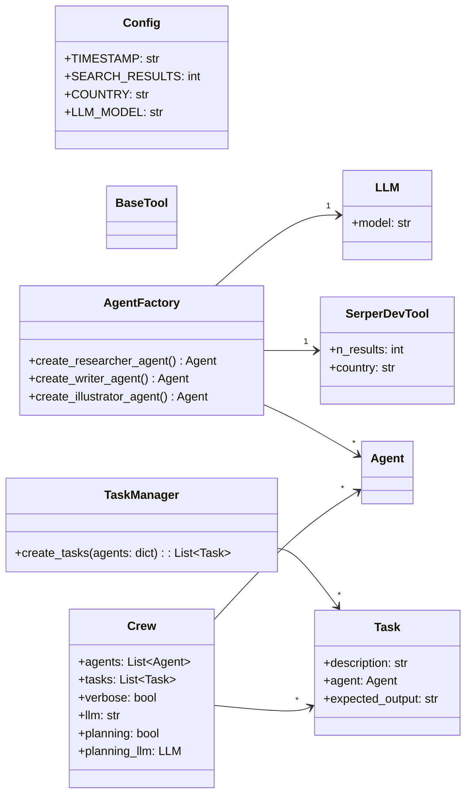

# George-Was-Right | v1.5 | Class Diagram

## Class Diagram

## Class Relationships

1. **Config Class**: 
   - This is a configuration class that holds application-wide constants such as model names and search results. It does not have direct relationships with other classes but provides configuration values used by some classes.

2. **AgentFactory Class**:
   - This factory class creates specialized `Agent` instances. It uses an `LLM` object to initialize each agent. It has methods to create different types of agents: `researcher`, `writer`, and `illustrator`.

3. **LLM Class**:
   - Represents a Language Learning Model used by agents for tasks. It's used by the `AgentFactory` to initialize agents with a specific model.

4. **SerperDevTool Class**:
   - Represents a tool used for internet searching, initialized with `Config` constants. The `AgentFactory` uses this in some agent initializations to equip agents with the necessary tools for specific tasks.

5. **Agent Class**:
   - A base class for specialized agents. Instances of `Agent` are created by the `AgentFactory`. The agents are part of the `Crew` and are involved in different tasks.

6. **TaskManager Class**:
   - Manages the creation of `Task` instances. It knows about agents as tasks are associated with specific agents. It’s a utility class to assign tasks to the agents created by the factory.

7. **Task Class**:
   - Represents a task to be executed by an agent. The `TaskManager` helps in creating tasks by associating them with the agents created by the `AgentFactory`.

8. **Crew Class**:
   - Represents the collection of `Agent` objects working together. It coordinates the execution of `Task` objects. Agents and tasks, created in the `main` function, are passed to the `Crew` for execution. `Crew` uses an `LLM` for its operation.

The flow generally works from initializing the configuration in `Config`, using `AgentFactory` to create various agents with the help of an `LLM` instance, creating tasks via `TaskManager`, and finally executing these tasks using the `Crew` class which combines both agents and tasks. The `SerperDevTool` is one of the specialized tools attached to agents for specific tasks.