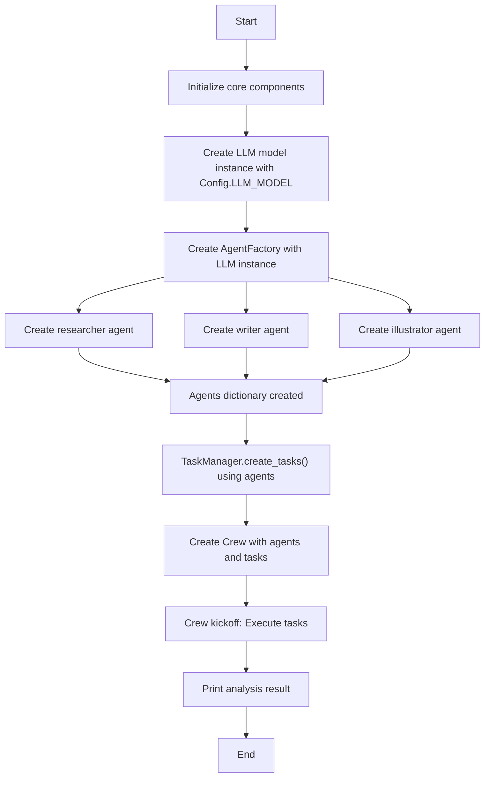

# George-Was-Right v1.5 Flowchart

## Chart

```mermaid
flowchart TD
    A["Start"] --> B["Initialize core components"]
    B --> C["Create LLM model instance with Config.LLM_MODEL"]
    C --> D["Create AgentFactory with LLM instance"]
    D --> E["Create researcher agent"]
    D --> F["Create writer agent"]
    D --> G["Create illustrator agent"]
    E --> H
    F --> H
    G --> H
    H["Agents dictionary created"] --> I["TaskManager.create_tasks() using agents"]
    I --> J["Create Crew with agents and tasks"]
    J --> K["Crew kickoff: Execute tasks"]
    K --> L["Print analysis result"]
    L --> M["End"]
```
