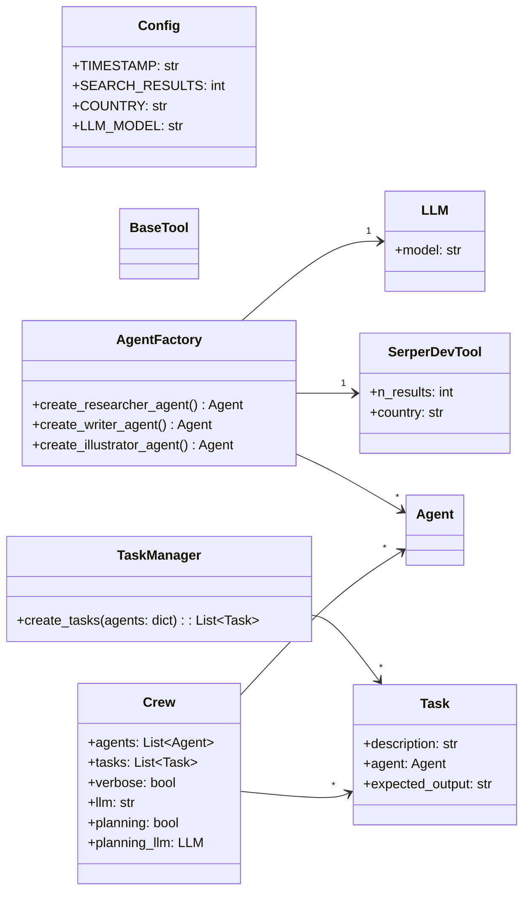

# v2.1 - Class classDiagram

```mermaid
classDiagram
  direction LR

  class Config {
      +TIMESTAMP: str
      +SEARCH_RESULTS: int
      +COUNTRY: str
      +LLM_MODEL: str
  }
  
  class Agent {
  }
  
  class LLM {
      +model: str
  }
  
  class BaseTool {
  }
  
  class SerperDevTool {
      +n_results: int
      +country: str
  }
  
  class AgentFactory {
      +create_researcher_agent() Agent
      +create_writer_agent() Agent
      +create_illustrator_agent() Agent
  }
  
  class TaskManager {
      +create_tasks(agents: dict): List~Task~
  }
  
  class Task {
      +description: str
      +agent: Agent
      +expected_output: str
  }
  
  class Crew {
      +agents: List~Agent~
      +tasks: List~Task~
      +verbose: bool
      +llm: str
      +planning: bool
      +planning_llm: LLM
  }

  AgentFactory --> "1" LLM
  AgentFactory --> "1" SerperDevTool
  AgentFactory --> "*" Agent
  TaskManager --> "*" Task
  Crew --> "*" Agent
  Crew --> "*" Task
```
